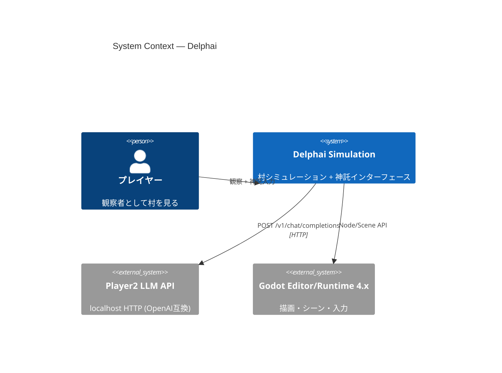
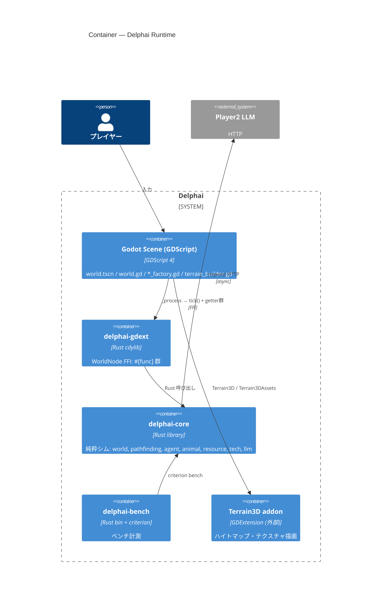
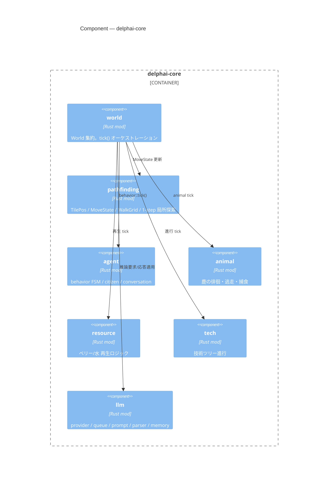
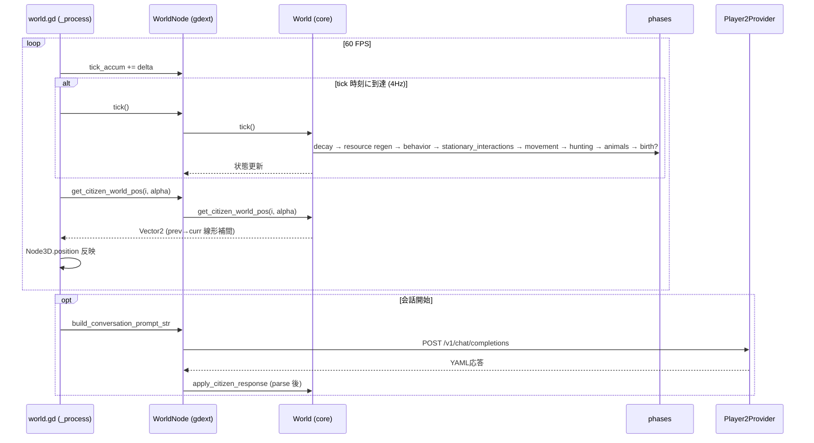

<!-- Generated: 2026-04-20 | Files scanned: ~25 | Token estimate: ~1200 -->

# アーキテクチャ (C4 モデル)

Delphai は Godot 4 を描画/入力、Rust を純粋シム、という二層構造。gdext FFI が境界。LLM は唯一のネット依存で、再構築時にも保存する部分。

## 1. System Context (C4 Level 1)

## 2. Container (C4 Level 2)

## 3. Component (C4 Level 3) — delphai-core 内部

## 4. 毎フレーム / 毎 tick のデータフロー

## 5. 設計原則

- **境界は FFI 一本**。gdext 以外に GDScript↔Rust の経路は作らない
- **コアは `godot` クレート非依存**。`delphai-core` は単体で `cargo test` 可能
- **tick は 4Hz (DAY_TICKS=600)**、描画は 60FPS。補間は Rust 側で実行 (`MoveState.prev_tile_pos`)
- **LLM は副作用の境界**。`InferenceQueue` で優先度制御、応答は YAML パース後に `apply_citizen_response`
- **再構築時に残すのは `llm/` サブモジュール一式のみ**。world/pathfinding/agent/animal/resource/tech/gdext は作り直し対象

## 6. 主要パラメータ (定数)

| 定数 | 値 | 定義元 |
|---|---|---|
| TICK_RATE | 4 Hz | `world.gd` |
| MAP_SIZE | 24×14 | `world.gd` / `World::new` |
| TILE_SIZE | 2.0 m | `world.gd` / core |
| DAY_TICKS | 600 | `world.rs` |
| FED_DECAY | 0.004/tick | `world.rs` |
| HYDRATION_DECAY | 0.007/tick | `world.rs` |
| MAX_CITIZENS | 8 | `world.rs` |
| BIRTH_THRESHOLD | 200 ticks | `world.rs` |
| STEP_COOLDOWN / ARRIVE_COOLDOWN | 0 / 1 | `pathfinding.rs` |
