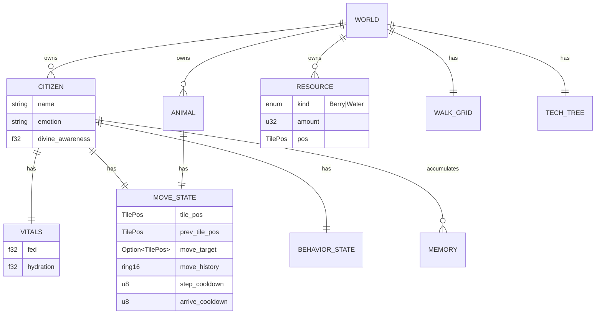
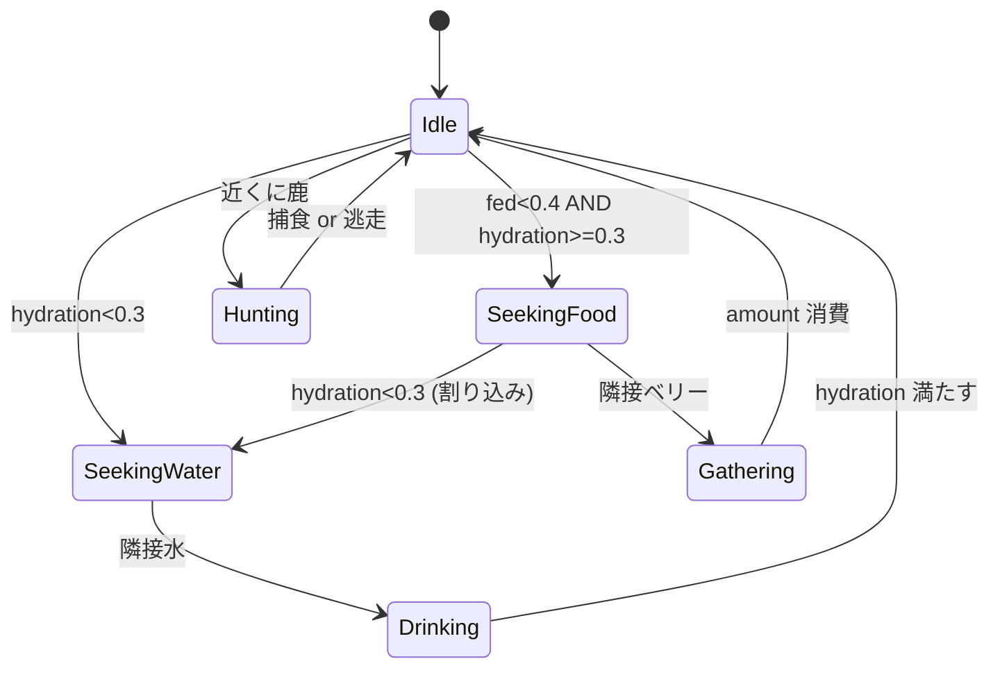
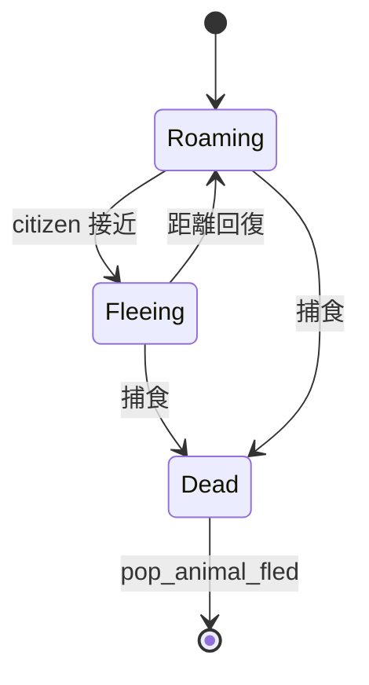

<!-- Generated: 2026-04-20 | Files scanned: ~8 | Token estimate: ~800 -->

# Data — ランタイムデータモデル

**データベースなし**。全状態は Rust `World` 構造体にインメモリで保持、プロセス終了時に消失。永続化は現在未実装。

## エンティティ関係 (概念)



## 値オブジェクト

| 型 | 定義 | 用途 |
|---|---|---|
| `TilePos { x: i16, y: i16 }` | 不変 | タイル座標 |
| `Vector2 (Godot)` | 可変 | ワールド座標 (FFI 戻り値) |
| `Needs { fed, hydration }` | 不変 | behavior 入力 |
| `BehaviorAction` | enum | behavior 出力、world が適用 |

## 集約ルート

`World` が唯一の集約ルート。以下を parallel `Vec` で保持 (ECS ライクだがクレート非依存):

```rust
citizens:         Vec<Citizen>          // length = N
behavior_states:  Vec<BehaviorState>    // length = N
vitals:           Vec<Vitals>           // length = N
move_states:      Vec<MoveState>        // length = N
```

**不変条件**: 4 つの Vec の長さは常に等しい。追加/削除は `World` メソッド経由のみ。

## 状態遷移

### BehaviorState



### AnimalState



## 定数カタログ

| 定数 | 値 | モジュール |
|---|---|---|
| `DAY_TICKS` | 600 | world |
| `TICK_RATE_HZ` | 4 | GDScript |
| `FED_DECAY` | 0.004 / tick | world |
| `HYDRATION_DECAY` | 0.007 / tick | world |
| `FED_LOW` | 0.4 | behavior |
| `HYDRATION_LOW` | 0.3 | behavior |
| `MAX_CITIZENS` | 8 | world |
| `BIRTH_THRESHOLD` | 200 ticks | world |
| `PROSPERITY_THRESHOLD` | 0.8 | world |
| `MAP_W × MAP_H` | 24 × 14 | world |
| `TILE_SIZE` | 2.0 m | world / gdext |
| `STEP_COOLDOWN` | 0 | pathfinding |
| `ARRIVE_COOLDOWN` | 1 | pathfinding |
| `MOVE_HISTORY_LEN` | 16 | pathfinding |

## LLM データ形状

**プロンプト入力** (GDScript → Rust 経由):
```yaml
# 抜粋 (prompt.rs が組み立て)
citizen: { name, emotion, needs, memory_recent }
context: { weather, nearby, heard }
```

**応答 (LLM → Rust)**:
```yaml
text: "..."
emotion: Calm|Joyful|Afraid|Angry|Sad
action: { kind: "say"|"move"|"none", target?: {x,y} }
```

`YamlResponseParser` が失敗したら JSON 互換パーサーでリトライ。

## 初期シード (gdext `initialize()`)

- 3 citizens: **Kael** (divine_awareness=1.0), **Elder** (0.65), **Hara** (0.0)
- 4 berry bushes
- 3 water sources
- 3 deer
- village center: (21, 10) SE 平坦地、spawn 範囲 (20–22, 10)

## 永続化 (未実装)

現状プロセス起動のたびに初期シードで開始。将来 save/load を足す場合は `World` の `Serialize/Deserialize` 派生 + gdext に save/load FFI を追加する設計が素直。
