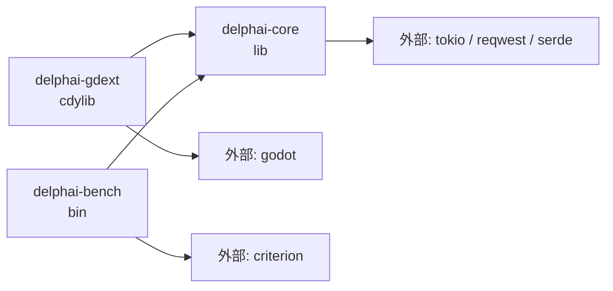

<!-- Generated: 2026-04-20 | Files scanned: ~6 | Token estimate: ~700 -->

# Dependencies — 外部依存

## クレート (Rust)

### workspace 共通 (`Cargo.toml`)

| クレート | 用途 | 備考 |
|---|---|---|
| `godot` 0.2 | gdext FFI | delphai-gdext のみ使用 |
| `tokio` 1 (full) | 非同期ランタイム | LLM |
| `reqwest` 0.12 (rustls) | HTTP クライアント | Player2Provider |
| `serde` / `serde_json` / `serde_yaml` | シリアライズ | LLM プロンプト/応答 |
| `async-trait` | trait の async fn | LlmProvider |
| `thiserror` 2 | エラー型 | LlmError |
| `criterion` 0.5 | ベンチマーク | delphai-bench のみ |

### クレート構成



`delphai-core` は `godot` クレート非依存。これが「純粋シム」たる条件。

## Godot 側依存

| 依存 | 種類 | 用途 |
|---|---|---|
| Godot 4.x | エンジン | シーン / 描画 / 入力 |
| Terrain3D addon | GDExtension | ハイトマップ地形 (`addons/terrain_3d/`) |
| delphai-gdext | GDExtension (自製) | Rust FFI (`delphai.gdextension`) |

**GLB アセット**: `game/assets/` 配下。`glb_loader.gd` が fallback 付きロード。

## 外部サービス

| サービス | プロトコル | 用途 |
|---|---|---|
| Player2 LLM | HTTP POST `http://localhost:4315/v1/chat/completions` | 住民の発話生成 (OpenAI 互換 API) |

Player2 は **ローカル起動前提**。未起動時は `LlmError::Network` でフォールバック、会話はスキップ。

## ビルド出力

| 成果物 | 場所 | 用途 |
|---|---|---|
| `libdelphai_gdext.{so,dylib,dll}` | `prebuilt/{linux,macos,windows}/{debug,release}/` | Godot が dlopen |
| `delphai.gdextension` | `game/` | Godot が読み取るマニフェスト |

`prebuilt/macos/debug/libdelphai_gdext.dylib` は git 管理 (CI レス運用のため)。

## 開発ツール

| ツール | 用途 |
|---|---|
| `cargo test` | Rust テスト (168 + 4) |
| `cargo clippy` | lint (警告 0 保持) |
| `cargo bench -p delphai-bench` | LLM スループット |
| Godot MCP | エディタ操作 / ランタイム確認 |
| `make` | ビルド・テスト一括 (`Makefile`) |

## Makefile ターゲット (概要)

```
make build       # cargo build + dylib を prebuilt/ にコピー
make test        # cargo test (全クレート)
make clippy      # cargo clippy -- -D warnings
make bench       # cargo bench -p delphai-bench
make godot-run   # Godot エディタ起動
```

## 再構築時の依存保存方針

| 対象 | 保存 | 理由 |
|---|---|---|
| `llm/` サブモジュール | **保存** | ユーザー指示: LLM は残す |
| `tokio` / `reqwest` / `serde_yaml` 依存 | 保存 | LLM が依存 |
| `godot` クレート | 再採用 | gdext は書き直すが同じクレートを使う |
| `Terrain3D` addon | 要再評価 | 現状の合成ハイトマップが複雑化の原因。プリミティブに戻す選択肢あり |
| `criterion` | 保存 | ベンチは有用 |

## セキュリティ

- 秘密鍵・トークンなし (ローカル LLM、鍵不要)
- `reqwest` は `rustls` のみ (OpenSSL 系の脆弱性影響を避ける)
- 外部入力は LLM 応答のみ → `YamlResponseParser` で構造検証、想定外フィールドは無視
